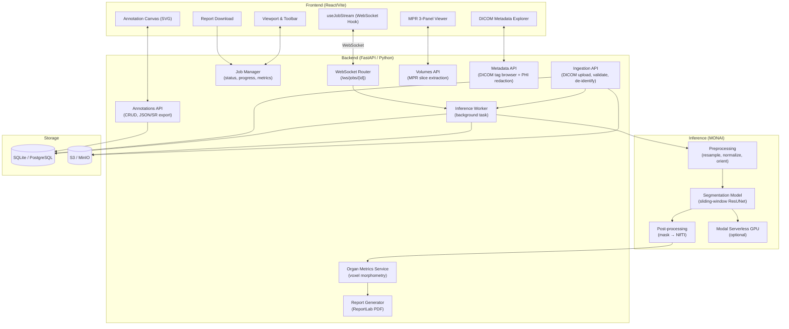
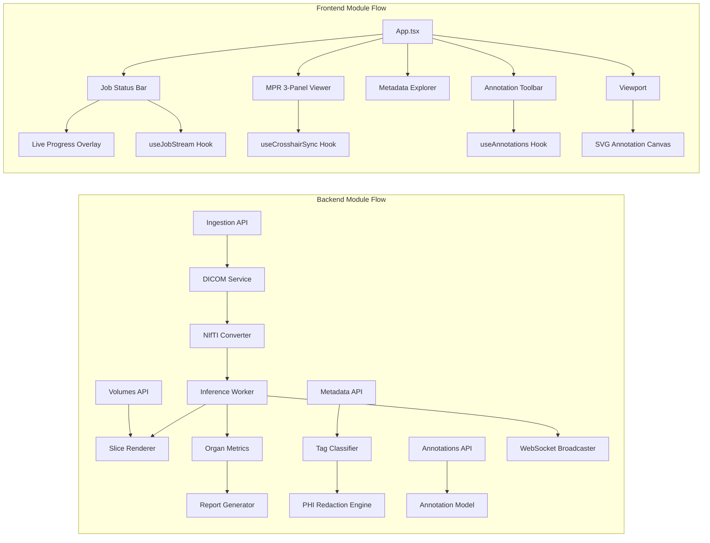

# Medical Image Analysis Pipeline

A production-grade, AI-augmented medical imaging platform designed for clinical research and radiology workflows. Features automated DICOM ingestion with PS 3.15 de-identification, MONAI-powered multi-organ segmentation on serverless GPU, real-time WebSocket inference streaming, interactive Multi-Planar Reconstruction (MPR), a DICOM tag metadata explorer with PHI redaction, persistent measurement & annotation tools, organ volumetric morphometrics, and automated clinical PDF report generation.

## Features

### Core Functionality
- **DICOM Ingestion**: Upload single `.dcm` files, multi-slice study folders, or ZIP archives via drag-and-drop. The pipeline validates each file, automatically de-identifies PHI per DICOM PS 3.15, assembles the series hierarchy, and queues it for preprocessing
- **NIfTI Conversion**: Pixel arrays are resampled, reoriented, and written to compressed NIfTI volumes ready for MONAI transform chains and inference
- **Background Inference Jobs**: Processing jobs run as non-blocking background workers — DICOM → preprocessing → sliding-window GPU inference — with full lifecycle tracking (`queued → preprocessing → inferring → completed → failed`)
- **Job Management**: View all active and historical processing jobs with real-time status, progress percentage, and error messages
- **API Key Security**: All mutation endpoints require a configurable `MEDICAL_API_KEY` header for access control

### Advanced Features
- **WebSocket Inference Streaming**: Real-time job progress delivery over persistent WebSocket connections (`/ws/jobs/{id}`). Heartbeat pings every 30 seconds prevent connection drops during long-running GPU jobs. A `useJobStream` React hook manages connection lifecycle, and a `LiveProgressOverlay` renders animated progress bars and status transitions without polling
- **DICOM Metadata Explorer**: Full DICOM tag browser for any uploaded study, surfacing every attribute grouped by functional module (Patient, Study, Series, Image, Equipment). Tags are classified by PS 3.15 sensitivity — PHI attributes are automatically redacted with `[REDACTED_PHI]` placeholders. Toggle de-identification on/off per session for clinical review or audit workflows
- **Multi-Planar Reconstruction (MPR) Viewer**: Interactive 3-panel viewer rendering axial, coronal, and sagittal planes simultaneously from the NIfTI volume. A `useCrosshairSync` hook synchronizes slice position across all three planes. Window/level presets (Soft Tissue, Bone, Lung, Brain) apply standardized radiological display protocols
- **Measurement & Annotation System**: Clinical measurement tools drawn directly on the SVG canvas overlay:
  - **Caliper (Length)**: Two-point distance measurement with real-world mm calibration from pixel spacing metadata
  - **Polygon Area**: Multi-vertex closed polygon with automatic area calculation in mm²
  - **Angle Measurement**: Three-point angle tool for angulation and alignment assessment
  - All annotations are persisted to the database per series and slice, with full CRUD and JSON/DICOM SR export
- **Organ Volumetric Morphometrics**: Voxel-based morphometry computes anatomical volumes (cm³), 3D bounding boxes, and shape descriptors for each segmented structure (Liver, Spleen, Kidneys, Pancreas). Risk flags are raised when organ sizes fall outside published clinical reference ranges
- **PDF Clinical Report Generation**: One-click generation of a formatted radiology PDF using ReportLab — patient pseudonym, study metadata, model details, organ volume table, risk evaluation summary. Downloadable directly from the Job Status bar

### DICOM De-Identification
- **PS 3.15 Compliance**: PatientName, PatientID, BirthDate, Age, ReferringPhysician, Institution, and Operator tags are masked on ingestion before any data is written to disk
- **Deterministic Anonymization**: Patient identifiers are replaced with a salted SHA-256 hash to enable longitudinal linkage within the same system without exposing real IDs
- **Metadata Redaction Toggle**: The DICOM tag explorer allows clinical staff to view redacted or unredacted values in-session — redaction is always applied to stored records

### Image Handling & Visualization
- **Thumbnail Panel**: Series-level thumbnail strip with one-click series switching and active series highlighting
- **SVG Canvas Overlay**: Annotation and measurement tools are rendered on a transparent SVG layer synchronized with the viewport, with zero interference with the underlying pixel data
- **Window/Level Presets**: Predefined radiological window settings for CT soft tissue, bone window, lung window, and brain window — toggled from the toolbar without manual HU entry
- **Slice Navigation**: Mouse-wheel and slider-based slice navigation with frame index display

## Tech Stack

### Backend
- **Python 3.14** with **FastAPI** for async HTTP and WebSocket endpoints
- **SQLAlchemy 2.x** ORM with **SQLite** (local) / **PostgreSQL** (production) metadata store
- **pydicom** for DICOM parsing, validation, and PS 3.15 de-identification
- **nibabel** for NIfTI volume I/O and voxel-space operations
- **numpy** for voxel morphometry and slice array extraction
- **MONAI** transform chain for medical image preprocessing (resample, normalize, orient)
- **Pillow** for slice-to-PNG rendering with window/level application
- **ReportLab** for clinical PDF generation with tables, styles, and structured layout
- **boto3** for S3/MinIO object storage integration
- **pydantic-settings** for environment-based configuration with `.env` support
- **pytest** + **httpx** for async API testing across all feature modules

### Frontend
- **React 19** with TypeScript
- **Vite 8** for fast development and optimized production builds
- **Tailwind CSS v4** for utility-first clinical dark theme styling
- **Lucide React** for consistent clinical iconography
- **Custom SVG Canvas** for annotation and measurement overlays (no external DICOM viewer dependency)
- **Native WebSocket API** with custom `useJobStream` hook for real-time inference progress
- **`clsx` + `tailwind-merge`** for conditional class management

### Inference
- **MONAI** sliding-window inferer with configurable ROI size and overlap
- **Modal** serverless GPU runner (`modal_app.py`) for scalable cloud inference
- **Local mock inference** fallback when no GPU endpoint is configured — enables full development and testing without GPU access
- **NIfTI-native workflow**: Volumes written as `.nii.gz`, loaded by MONAI, masks written back as NIfTI for downstream volumetrics

### Infrastructure
- **Docker Compose** orchestrating PostgreSQL, Redis, and MinIO for local development parity with production
- **MinIO** as S3-compatible local object storage for DICOM and NIfTI volume archival
- **SQLite** as zero-config fallback database for single-machine development

## System Architecture



## Module Dependency



## Project Structure

```
Medical/
├── backend/                        # FastAPI application (Python 3.14)
│   ├── app/
│   │   ├── api/
│   │   │   ├── ingestion.py        # DICOM upload, ZIP handling, de-id, NIfTI queuing
│   │   │   ├── jobs.py             # Job status, progress, PDF report download
│   │   │   ├── ws_jobs.py          # WebSocket /ws/jobs/{id} with heartbeat broadcast
│   │   │   ├── metadata.py         # DICOM tag browser with PS 3.15 PHI redaction
│   │   │   ├── volumes.py          # MPR slice extraction — axial/coronal/sagittal PNG
│   │   │   ├── annotations.py      # Annotation CRUD with JSON/SR export
│   │   │   └── routes.py           # Centralized router registration
│   │   ├── core/
│   │   │   ├── config.py           # Pydantic settings from .env
│   │   │   ├── database.py         # SQLAlchemy engine, session factory, Base
│   │   │   ├── security.py         # API key middleware
│   │   │   └── logging_middleware.py
│   │   ├── models/
│   │   │   └── imaging.py          # Patient, Study, Series, Instance, ProcessingJob, Annotation
│   │   ├── services/
│   │   │   ├── dicom_service.py    # pydicom validation, PS 3.15 de-id, metadata extraction
│   │   │   ├── nifti_converter.py  # Pixel array → NIfTI volume assembly and resampling
│   │   │   ├── slice_renderer.py   # NIfTI slice → windowed PNG with HU presets
│   │   │   ├── organ_metrics.py    # Voxel morphometry, bounding boxes, risk flags
│   │   │   ├── report_generator.py # ReportLab clinical PDF with organ table and risk summary
│   │   │   └── tag_classifier.py   # DICOM tag enrichment and module grouping
│   │   └── workers/
│   │       └── inference_worker.py # Background task: preprocess → infer → post-process → emit
│   ├── tests/
│   │   ├── test_ingestion.py
│   │   ├── test_metadata.py
│   │   ├── test_slice_endpoint.py
│   │   ├── test_annotations.py
│   │   ├── test_ws_streaming.py
│   │   ├── test_report.py
│   │   ├── test_serving.py
│   │   └── test_e2e_pipeline.py
│   ├── main.py
│   └── requirements.txt
├── frontend/                       # React 19 + Vite + Tailwind CSS v4
│   └── src/
│       ├── components/
│       │   ├── Viewport/           # Main DICOM viewport with SVG overlay
│       │   ├── MPRViewer/          # 3-panel axial/coronal/sagittal with crosshair sync
│       │   ├── Annotations/        # AnnotationToolbar — caliper, polygon, angle
│       │   ├── MetadataExplorer/   # DICOM tag browser with PHI redaction toggle
│       │   ├── Segmentation/       # SegmentationPanel + OrganStatsTable
│       │   ├── JobStatus/          # JobStatusBar with streaming overlay + report download
│       │   ├── LiveProgress/       # Animated progress bar and status badge
│       │   ├── ThumbnailPanel/     # Series thumbnail strip
│       │   ├── Toolbar/            # Window/level preset switcher
│       │   ├── Upload/             # Drag-and-drop DICOM/ZIP upload modal
│       │   └── Header.tsx
│       ├── hooks/
│       │   ├── useJobStream.ts     # WebSocket hook — connect, heartbeat, cleanup
│       │   ├── useCrosshairSync.ts # MPR crosshair sync across planes
│       │   └── useAnnotations.ts   # Annotation state + API persistence
│       ├── services/
│       │   ├── api.ts              # Typed REST client for all backend endpoints
│       │   └── cornerstoneInit.ts  # No-op shim (pure SVG rendering used)
│       ├── types/index.ts
│       └── App.tsx
├── inference/                      # MONAI inference module
│   ├── transforms/pipeline.py      # MONAI Compose — LoadImage, Orientation, ScaleIntensity
│   ├── inferer/segmenter.py        # SlidingWindowInferer with configurable ROI and overlap
│   ├── models/model_loader.py      # Model registry — loads UNet/ResUNet or mock
│   ├── modal_app.py                # Modal serverless GPU deployment definition
│   ├── service.py                  # Inference service — preprocess, infer, post-process
│   ├── serving_api.py              # FastAPI serving endpoint for Modal cloud deployment
│   └── tests/
├── infra/docker-compose.yml        # PostgreSQL, Redis, MinIO for local dev
├── .env                            # Local environment variables (gitignored)
├── .gitignore
└── README.md
```

## API Documentation Overview

All endpoints are prefixed under `/api/v1`.

### Ingestion
- `POST /upload/dicom` — Upload `.dcm` files or a ZIP archive. Validates, de-identifies per PS 3.15, assembles NIfTI, and queues an inference job. Returns `job_id` and series metadata
- `GET /studies` — List all ingested studies with patient pseudonym, date, modality, and series count
- `GET /studies/{study_id}` — Retrieve full study hierarchy (series → instances)
- `GET /series/{uid}/download` — Download original DICOM series as ZIP

### Jobs & Streaming
- `GET /jobs` — List all processing jobs with status and progress
- `GET /jobs/{job_id}` — Fetch real-time job status, progress percentage, and output metrics
- `GET /jobs/{job_id}/report` — Stream the generated clinical PDF as a binary download
- `WS /ws/jobs/{job_id}` — WebSocket endpoint for real-time inference event streaming with 30s heartbeat

### Multi-Planar Reconstruction
- `GET /volumes/{series_uid}/dimensions` — Returns spatial dimensions and voxel spacing for all three planes
- `GET /volumes/{series_uid}/slice` — Windowed PNG slice from NIfTI volume. Query params: `plane` (`axial`|`coronal`|`sagittal`), `index`, `window_preset`

### Metadata
- `GET /studies/{study_id}/metadata` — Full DICOM tag listing grouped by module. PHI redacted by default; pass `?redact=false` for unmasked view

### Annotations
- `GET /series/{uid}/annotations` — List annotations, optionally filtered by `plane` and `slice_index`
- `POST /series/{uid}/annotations` — Create caliper, polygon, or angle annotation with geometry and measurement value
- `PUT /annotations/{id}` — Update label or color
- `DELETE /annotations/{id}` — Remove annotation
- `GET /series/{uid}/annotations/export` — Export as JSON or DICOM SR

## Environment Variables

| Variable | Default | Description |
|---|---|---|
| `ENVIRONMENT` | `development` | Runtime environment |
| `DATABASE_URL` | `sqlite:///./medical_metadata.db` | SQLAlchemy connection string |
| `STORAGE_DIR` | `storage` | Root directory for local file storage |
| `UPLOAD_DIR` | `storage/uploads` | Raw DICOM upload staging area |
| `NIFTI_DIR` | `storage/nifti` | Converted NIfTI volume storage |
| `MASKS_DIR` | `storage/masks` | Inference output mask storage |
| `S3_ENDPOINT` | `http://localhost:9000` | MinIO / S3 endpoint URL |
| `S3_ACCESS_KEY` | `minioadmin` | S3 access key |
| `S3_SECRET_KEY` | `minioadminpassword` | S3 secret key |
| `S3_BUCKET` | `medical-imaging` | Target S3 bucket name |
| `MEDICAL_API_KEY` | `clin-demo-key-2026` | API key for protected endpoints |
| `MODAL_SERVING_URL` | _(none)_ | Modal GPU endpoint; omit for local mock |
| `USE_MOCK_INFERENCE_IF_NO_GPU` | `true` | Enable mock segmentation when no GPU is set |

## Getting Started

### Prerequisites
- Python 3.11+ (tested on 3.14)
- Node.js 20+
- Docker Desktop (optional — SQLite works for local dev without Docker)

### Backend
```bash
cd backend
pip install -r requirements.txt
python -m uvicorn main:app --host 0.0.0.0 --port 8000 --reload
```

### Frontend
```bash
cd frontend
npm install
npm run dev
# http://localhost:5174
```

### Local Services (Docker — optional)
```bash
docker-compose -f infra/docker-compose.yml up -d
# Then update DATABASE_URL in .env to the Postgres connection string
```

### Run Tests
```bash
cd backend
pytest tests/ -v
```

## Features in Detail

### DICOM Ingestion & De-Identification

The ingestion endpoint accepts individual `.dcm` files, multi-file uploads, or a ZIP archive. Each file is validated with pydicom before any data is persisted. PHI tags are overwritten in-memory using the PS 3.15 attribute table — patient name is replaced with `ANONYMIZED^PATIENT`, birth date with `19000101`, institution with `DE-IDENTIFIED CLINICAL CENTER`. The real patient identifier is hashed with a deterministic SHA-256 function so the same patient maps to the same pseudonym across re-uploads without storing the original ID. Pixel arrays are then assembled in slice-location order and written to a compressed NIfTI volume via nibabel.

### WebSocket Inference Streaming

When a job is submitted, the inference worker emits structured events at each pipeline stage using a `ConnectionManager` that holds per-job subscriber sets behind an `asyncio.Lock`. The `useJobStream` hook on the frontend opens a WebSocket connection, listens for `progress`, `status`, `error`, and `complete` events, and updates `LiveProgressOverlay` in real time. The server sends a ping frame every 30 seconds to prevent proxy-level timeouts during long GPU inference jobs. On component unmount the hook sends a graceful close frame and clears the reference.

### Multi-Planar Reconstruction (MPR)

The volumes API extracts 2D slices from a 3D NIfTI volume for any of the three standard anatomical planes. For coronal and sagittal planes, the volume array axes are transposed before slicing to maintain correct anatomical orientation. Each slice is windowed using the selected HU preset (default: Soft Tissue, W=400 C=40), normalized to 0–255, and streamed as a PNG via `StreamingResponse`. The `MPRViewer` renders three `MPRPanel` instances side by side, and `useCrosshairSync` maintains a shared slice-index state so scrolling one panel updates the crosshair line overlay in the other two.

### Measurement & Annotation System

Annotation tools are implemented as SVG elements rendered over the viewport canvas. In caliper mode, clicking sets the first anchor; a second click records the endpoint and computes Euclidean pixel distance, calibrated to millimeters using the `PixelSpacing` DICOM attribute. Polygon mode accumulates vertex clicks and auto-closes on double-click, computing area via the shoelace formula. Angle mode captures three points and computes the interior angle with `Math.atan2`. All measurements are posted to the annotations API with geometry payload, measurement value, unit, and slice context — queryable per series for longitudinal comparison.

### Organ Volumetrics & Risk Flags

After inference, `compute_organ_morphometrics` loads the NIfTI mask and iterates over label IDs (1: Liver, 2: Spleen, 3: Kidneys, 4: Pancreas). For each organ it counts voxels, multiplies by voxel volume derived from the NIfTI header spacing, and converts mm³ to cm³. A 3D bounding box is computed from nonzero coordinate extents. Risk flags are raised when volumes fall outside published clinical reference ranges. All metrics are stored in the `ProcessingJob.metrics` JSON column for retrieval by the report generator and `OrganStatsTable` component.

### Clinical PDF Report Generation

The report generator uses ReportLab's `SimpleDocTemplate` to compose a structured clinical document: a header block with patient pseudonym and study date, model information (MONAI 3D Multi-Organ ResUNet, inference timestamp), an organ volume table with risk flags highlighted in amber/red, and a free-text clinical summary. The PDF is written to an in-memory `BytesIO` buffer and returned as a binary stream from `GET /jobs/{id}/report`. The `JobStatusBar` shows a download button that triggers a browser-native file save once the job reaches `completed` state.

## Development Roadmap

### Phase 1: Foundation (Completed)
- DICOM ingestion with PS 3.15 de-identification and deterministic patient pseudonymization
- NIfTI volume assembly and local file storage
- SQLAlchemy metadata store — Patient → Study → Series → Instance hierarchy
- Background inference job runner with full lifecycle status tracking
- FastAPI REST API with Docker Compose infrastructure (PostgreSQL, Redis, MinIO)

### Phase 2: Inference Engine (Completed)
- MONAI transform pipeline (resample, normalize, orient, crop)
- SlidingWindowInferer with configurable ROI and overlap
- Mock inference fallback for GPU-less development and CI
- Modal serverless GPU deployment definition
- Unit and integration tests for transforms and segmentation

### Phase 3: Clinical Visualization (Completed)
- React + Vite frontend with clinical dark theme
- SVG-based viewport with DICOM slice rendering
- Thumbnail panel for series navigation
- Window/level preset toolbar (Soft Tissue, Bone, Lung, Brain)
- SegmentationPanel with overlay toggle

### Phase 4: Advanced Features — 5 Features × 35 Commits (Completed)
- **WebSocket Inference Streaming**: Real-time job progress over persistent WebSocket connections with 30s heartbeat and `LiveProgressOverlay`
- **DICOM Metadata Explorer**: Full tag browser with PS 3.15 PHI redaction, functional module grouping, and per-session redaction toggle
- **MPR Multi-Planar Viewer**: Synchronized 3-panel axial/coronal/sagittal viewer with `useCrosshairSync` and HU window presets
- **Measurement & Annotation System**: Caliper, polygon, and angle tools on the SVG canvas with persistent CRUD API and JSON/DICOM SR export
- **PDF Clinical Report Generation**: Organ voxel-based morphometrics, reference-range risk flags, and automated ReportLab PDF with one-click download

### Phase 5: Production Hardening (Planned)
- PostgreSQL migration from SQLite with Alembic versioned migrations
- S3/MinIO volume archival with pre-signed URL delivery
- Authentication layer (OAuth2 / institutional SSO)
- Audit log for all PHI access and de-identification events
- DICOM WADO-RS compliant series retrieval endpoint
- Celery + Redis task queue for horizontal inference worker scaling

### Phase 6: Clinical Intelligence (Planned)
- AI-assisted report drafting from organ metrics using an LLM
- Longitudinal volume tracking across studies for the same pseudonymized patient
- Automated comparison to prior segmentation masks (Dice, Hausdorff distance)
- DICOM RT Structure Set export for radiotherapy planning integration
- HL7 FHIR R4 DiagnosticReport resource generation for EHR integration
